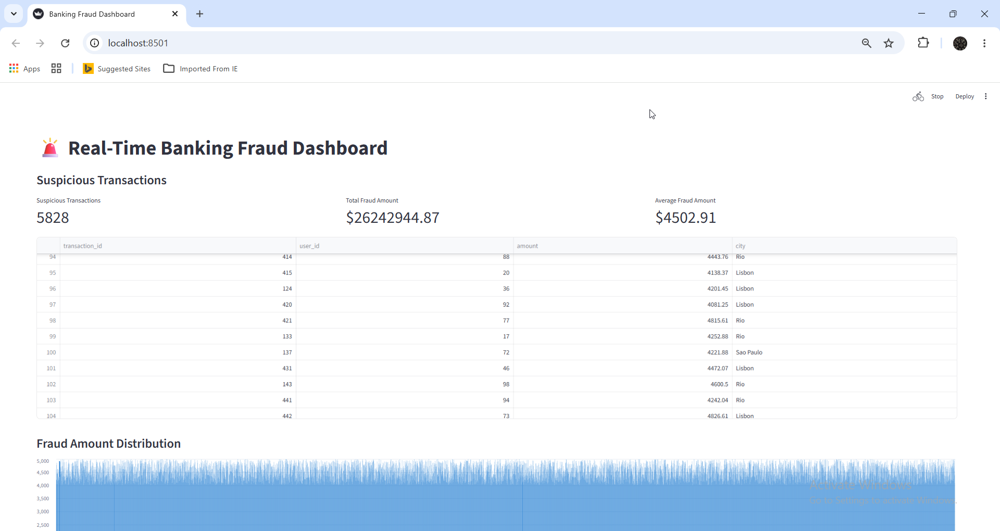
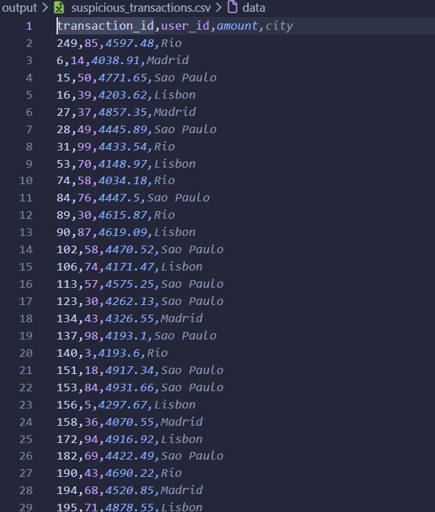
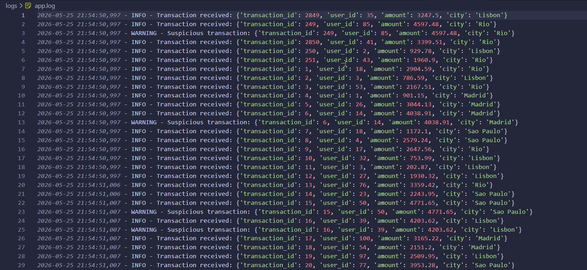

# Real-Time Banking Fraud Detection Pipeline

# Pipeline de Detección de Fraude Bancario en Tiempo Real

---

## System Architecture


---

## Live Demo

🎥 [Watch the Kafka Streaming Demo](assets/demo.mp4)

---

## Real-Time Streaming Architecture

```text
Python Producer
        ↓
Apache Kafka Topic
        ↓
Modular Consumer Analytics
        ↓
Fraud Detection Engine
        ↓
CSV Storage + Logging
        ↓
Streamlit Real-Time Dashboard
```

---

# 🇺🇸 English Version

## Overview

This project simulates a real-time banking fraud detection system using Apache Kafka, Python, and Streamlit.

The pipeline continuously generates banking transactions, streams them through Kafka, processes them in real time, detects suspicious activities, stores suspicious transactions into CSV files, logs events, and visualizes fraud analytics through a live dashboard.

The project demonstrates concepts commonly used in modern fintech, backend engineering, and data engineering systems.

---

## Features

* Real-time transaction streaming
* Apache Kafka producer/consumer architecture
* Modular project architecture
* Fraud detection engine
* CSV persistence layer
* Logging and monitoring system
* Real-time fraud analytics
* Streamlit live dashboard
* Event-driven pipeline design
* Real-time suspicious transaction visualization

---

## Technologies Used

* Python
* Apache Kafka
* confluent-kafka
* Streamlit
* Pandas
* JSON
* CSV
* Logging

---

## Project Structure

```text
banking-kafka-project/
│
├── producer/
│   ├── __init__.py
│   └── main_producer.py
│
├── consumer/
│   ├── __init__.py
│   ├── main_consumer.py
│   ├── fraud_detection.py
│   ├── statistics.py
│   └── storage.py
│
├── dashboard/
│   └── dashboard.py
│
├── config/
│   ├── __init__.py
│   └── settings.py
│
├── logs/
│   └── app.log
│
├── output/
│   └── suspicious_transactions.csv
│
├── assets/
│   ├── architecture-diagram.png
│   ├── dashboard.png
│   ├── producer-output.png
│   ├── consumer-output.png
│   ├── kafka-topic.png
│   └── demo.mp4
│
├── requirements.txt
├── README.md
└── .gitignore
```

---

## Fraud Detection Logic

Transactions are flagged as suspicious when:

* transaction amount exceeds a configured threshold
* transaction originates from risky locations

Example:

```python
if amount > 4000:
    return True
```

---

## Dashboard Preview



The dashboard displays:

* suspicious transactions
* fraud metrics
* fraud amount analytics
* real-time updates

---

## CSV Output Storage



Suspicious transactions are automatically persisted into CSV files for further analysis and reporting.

---

## Application Logging



The logging system records:
- transaction processing
- suspicious activity alerts
- consumer errors
- monitoring events

---

## Producer Streaming Transactions


---

## Consumer Fraud Detection


---

## Kafka Topic Messages


---

## How to Run the Project

### 1. Start Apache Kafka

Start:

* Kafka Controller
* Kafka Broker

---

### 2. Run Producer

```bash
python -m producer.main_producer
```

The producer continuously generates fake banking transactions and streams them into Kafka.

---

### 3. Run Consumer

```bash
python -m consumer.main_consumer
```

The consumer:

* processes streaming transactions
* detects suspicious activity
* stores suspicious transactions
* updates fraud statistics
* logs events

---

### 4. Run Dashboard

```bash
streamlit run dashboard/dashboard.py
```

The Streamlit dashboard visualizes fraud analytics in real time.

---

## Logging

Application logs are stored inside:

```text
logs/app.log
```

The log system records:

* transaction processing
* suspicious activity alerts
* consumer errors
* monitoring events

---

## CSV Output

Suspicious transactions are automatically stored inside:

```text
output/suspicious_transactions.csv
```

---

## Future Improvements

* PostgreSQL integration
* FastAPI REST API
* Machine Learning fraud scoring
* Docker support
* Cloud deployment
* PySpark Structured Streaming
* Real-time alerting system

---

## Learning Objectives

This project was created to practice:

* event-driven architecture
* Kafka streaming systems
* real-time analytics
* backend engineering concepts
* fraud detection systems
* modular Python architecture
* data engineering fundamentals

---

# 🇪🇸 Versión en Español

## Descripción General

Este proyecto simula un sistema de detección de fraude bancario en tiempo real utilizando Apache Kafka, Python y Streamlit.

El pipeline genera continuamente transacciones bancarias, las transmite mediante Kafka, las procesa en tiempo real, detecta actividades sospechosas, almacena transacciones fraudulentas en archivos CSV, registra eventos y visualiza analíticas de fraude mediante un dashboard en vivo.

El proyecto demuestra conceptos utilizados en sistemas modernos de fintech, backend engineering y data engineering.

---

## Características

* Streaming de transacciones en tiempo real
* Arquitectura Producer/Consumer con Apache Kafka
* Arquitectura modular del proyecto
* Motor de detección de fraude
* Persistencia en CSV
* Sistema de logs y monitoreo
* Analítica de fraude en tiempo real
* Dashboard en vivo con Streamlit
* Diseño orientado a eventos
* Visualización de transacciones sospechosas

---

## Tecnologías Utilizadas

* Python
* Apache Kafka
* confluent-kafka
* Streamlit
* Pandas
* JSON
* CSV
* Logging

---

## Lógica de Detección de Fraude

Las transacciones se consideran sospechosas cuando:

* el monto supera el límite configurado
* la transacción proviene de ubicaciones riesgosas

Ejemplo:

```python
if amount > 4000:
    return True
```

---

## Vista del Dashboard


El dashboard muestra:

* transacciones sospechosas
* métricas de fraude
* analíticas de montos fraudulentos
* actualizaciones en tiempo real

---

## Almacenamiento de Salida CSV


Las transacciones sospechosas se almacenan automáticamente en archivos CSV para análisis y reportes posteriores.

---

## Sistema de Logs


El sistema de logs registra:
- procesamiento de transacciones
- alertas de actividades sospechosas
- errores del consumer
- eventos de monitoreo

---

## Ejecución del Producer


---

## Detección de Fraude del Consumer


---

## Mensajes del Topic Kafka


---

## Cómo Ejecutar el Proyecto

### 1. Iniciar Apache Kafka

Iniciar:

* Kafka Controller
* Kafka Broker

---

### 2. Ejecutar el Producer

```bash
python -m producer.main_producer
```

---

### 3. Ejecutar el Consumer

```bash
python -m consumer.main_consumer
```

---

### 4. Ejecutar el Dashboard

```bash
streamlit run dashboard/dashboard.py
```

---

## Logs

Los logs se almacenan en:

```text
logs/app.log
```

---

## Archivo CSV

Las transacciones sospechosas se almacenan automáticamente en:

```text
output/suspicious_transactions.csv
```

---

## Futuras Mejoras

* Integración con PostgreSQL
* API REST con FastAPI
* Machine Learning para fraude
* Docker
* Despliegue en la nube
* PySpark Structured Streaming
* Sistema de alertas en tiempo real

---

## Objetivos de Aprendizaje

Este proyecto fue creado para practicar:

* arquitectura orientada a eventos
* sistemas de streaming con Kafka
* analítica en tiempo real
* conceptos de backend engineering
* sistemas de detección de fraude
* arquitectura modular en Python
* fundamentos de data engineering
