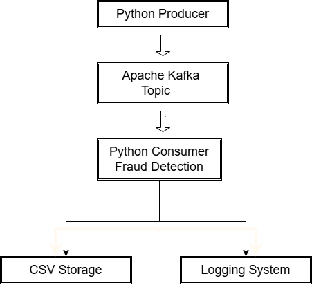
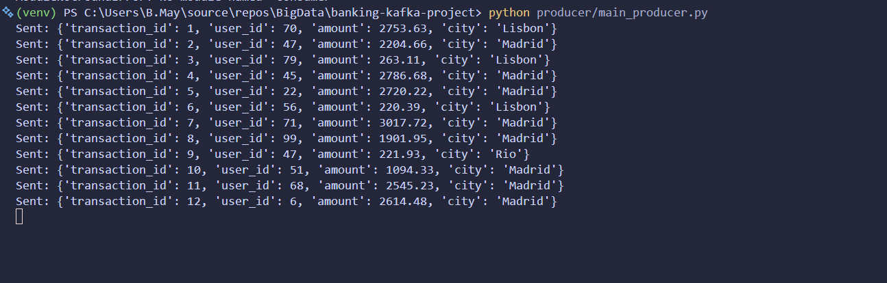
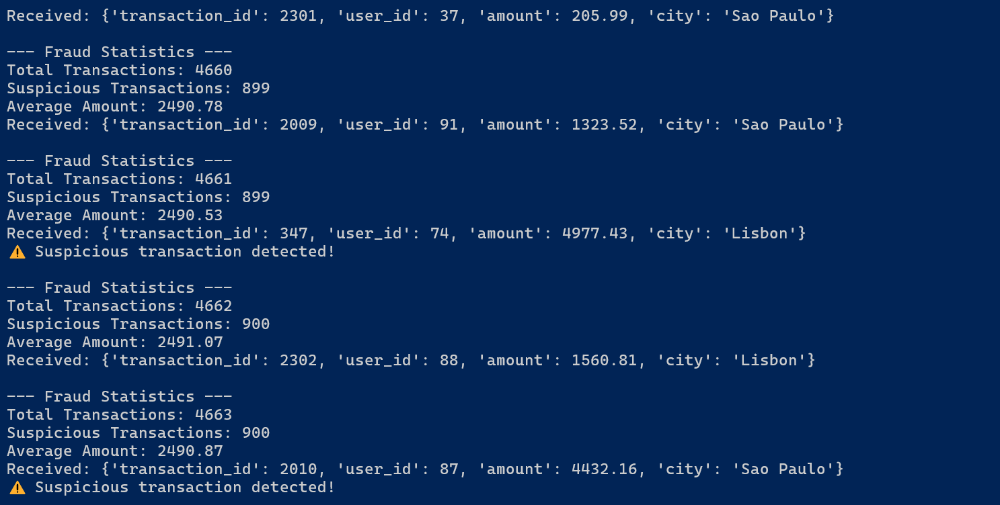
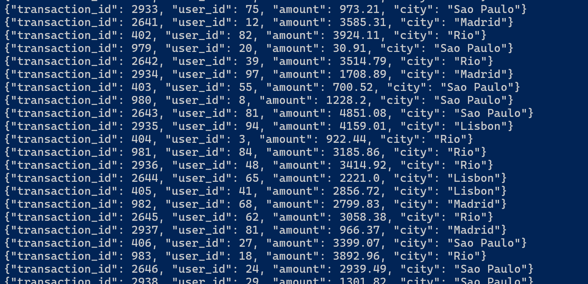

# Real-Time Banking Fraud Detection Pipeline
# Pipeline de Detección de Fraude Bancario en Tiempo Real

---

## System Architecture



---

## Live Demo


---

## Real-Time Streaming Architecture

```text
Python Producer
        ↓
Apache Kafka Topic
        ↓
Python Consumer Analytics
        ↓
Fraud Detection Engine
        ↓
CSV Storage + Logging + Statistics
```

---

# 🇺🇸 English Version

## Overview

This project simulates a real-time banking transaction processing pipeline using Apache Kafka and Python.

The system generates streaming banking transactions, processes them in real time, detects suspicious activities, stores flagged transactions into CSV files, and generates live fraud statistics.

This project demonstrates concepts commonly used in modern fintech and data engineering systems such as:

- Event-driven architecture
- Real-time stream processing
- Kafka producer/consumer workflows
- Fraud detection pipelines
- Streaming analytics

---

## Architecture

```text
Python Producer
        ↓
Apache Kafka Topic
        ↓
Python Consumer Analytics
        ↓
Fraud Detection
        ↓
CSV Storage + Logging + Statistics
```

---

## Features

- Real-time transaction streaming
- Apache Kafka producer/consumer architecture
- Fraud detection logic
- Real-time analytics and statistics
- CSV export for suspicious transactions
- Logging system
- Structured project organization
- Event-driven pipeline design

---

## Technologies Used

- Python
- Apache Kafka
- confluent-kafka
- JSON
- CSV
- Logging

---

## Project Structure

```text
banking-kafka-project/
│
├── producer.py
├── consumer.py
├── requirements.txt
├── README.md
├── .gitignore
│
├── logs/
│   └── app.log
│
├── output/
│   └── suspicious_transactions.csv
│
└── assets/
    ├── producer-output.png
    ├── consumer-output.png
    └── kafka-topic.png
```

---

## Example Transaction

```json
{
  "transaction_id": 15,
  "user_id": 42,
  "amount": 4850.75,
  "city": "Sao Paulo"
}
```

---

## Fraud Detection Logic

Transactions with amounts greater than 4000 are flagged as suspicious.

Example:

```python
if amount > 4000:
    suspicious_transactions += 1
```

---

## Screenshots

### Producer Streaming Transactions



---

### Consumer Fraud Detection



---

### Kafka Topic Messages



---

## How to Run the Project

### 1. Start Apache Kafka

Start:
- Kafka Controller
- Kafka Broker

---

### 2. Run Producer

```bash
python producer.py
```

The producer continuously generates fake banking transactions and sends them to Kafka.

---

### 3. Run Consumer

```bash
python consumer.py
```

The consumer:
- reads streaming transactions
- detects suspicious activity
- stores suspicious transactions into CSV
- generates real-time statistics

---

## Sample Console Output

```text
Received: {'transaction_id': 7, 'user_id': 22, 'amount': 4850.23, 'city': 'Madrid'}

⚠️ Suspicious transaction detected!

--- Fraud Statistics ---
Total Transactions: 15
Suspicious Transactions: 2
Average Amount: 2410.54
```

---

## Logging

The application stores logs inside:

```text
logs/app.log
```

This includes:
- transaction processing logs
- suspicious activity alerts
- Kafka consumer errors

---

## CSV Output

Suspicious transactions are automatically stored inside:

```text
output/suspicious_transactions.csv
```

---

## Future Improvements

- PySpark Structured Streaming integration
- Machine Learning fraud detection
- Docker support
- PostgreSQL integration
- Real-time dashboards
- Cloud deployment
- Stream processing optimization

---

## Learning Objectives

This project was created to practice:

- Event-driven architecture
- Kafka streaming systems
- Real-time analytics
- Data engineering fundamentals
- Fraud detection concepts
- Streaming pipeline design

---

# 🇪🇸 Versión en Español

## Descripción General

Este proyecto simula un pipeline de procesamiento de transacciones bancarias en tiempo real utilizando Apache Kafka y Python.

El sistema genera transacciones bancarias en streaming, las procesa en tiempo real, detecta actividades sospechosas, almacena las transacciones fraudulentas en archivos CSV y genera estadísticas en vivo.

El proyecto demuestra conceptos modernos utilizados en sistemas fintech y de ingeniería de datos, como:

- Arquitectura orientada a eventos
- Procesamiento de streams en tiempo real
- Workflows Producer/Consumer con Kafka
- Pipelines de detección de fraude
- Analítica en tiempo real

---

## Arquitectura

```text
Productor en Python
        ↓
Topic de Apache Kafka
        ↓
Consumidor Analítico en Python
        ↓
Detección de Fraude
        ↓
CSV + Logs + Estadísticas
```

---

## Características

- Streaming de transacciones en tiempo real
- Arquitectura Producer/Consumer con Apache Kafka
- Lógica de detección de fraude
- Analítica y estadísticas en tiempo real
- Exportación CSV de transacciones sospechosas
- Sistema de logs
- Organización profesional del proyecto
- Diseño basado en eventos

---

## Tecnologías Utilizadas

- Python
- Apache Kafka
- confluent-kafka
- JSON
- CSV
- Logging

---

## Ejemplo de Transacción

```json
{
  "transaction_id": 15,
  "user_id": 42,
  "amount": 4850.75,
  "city": "Sao Paulo"
}
```

---

## Lógica de Detección de Fraude

Las transacciones con montos superiores a 4000 son marcadas como sospechosas.

Ejemplo:

```python
if amount > 4000:
    suspicious_transactions += 1
```

---

## Capturas de Pantalla

### Producer Enviando Transacciones


---

### Consumer Detectando Fraude


---

### Mensajes del Topic Kafka


---

## Cómo Ejecutar el Proyecto

### 1. Iniciar Apache Kafka

Iniciar:
- Kafka Controller
- Kafka Broker

---

### 2. Ejecutar el Producer

```bash
python producer.py
```

El producer genera continuamente transacciones bancarias falsas y las envía a Kafka.

---

### 3. Ejecutar el Consumer

```bash
python consumer.py
```

El consumer:
- lee transacciones en streaming
- detecta actividades sospechosas
- almacena transacciones fraudulentas en CSV
- genera estadísticas en tiempo real

---

## Logs

La aplicación almacena logs en:

```text
logs/app.log
```

---

## Archivo CSV

Las transacciones sospechosas se almacenan automáticamente en:

```text
output/suspicious_transactions.csv
```

---

## Mejoras Futuras

- Integración con PySpark Structured Streaming
- Machine Learning para detección de fraude
- Docker
- Integración con PostgreSQL
- Dashboards en tiempo real
- Despliegue en la nube

---

## Objetivos de Aprendizaje

Este proyecto fue creado para practicar:

- Arquitectura orientada a eventos
- Sistemas de streaming con Kafka
- Analítica en tiempo real
- Fundamentos de Data Engineering
- Conceptos de detección de fraude
- Diseño de pipelines de streaming