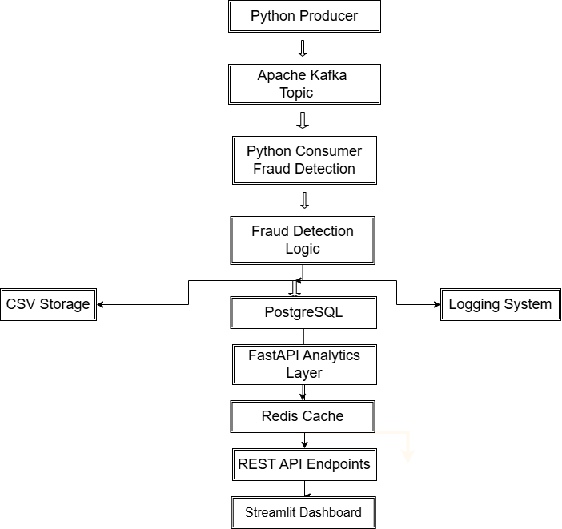
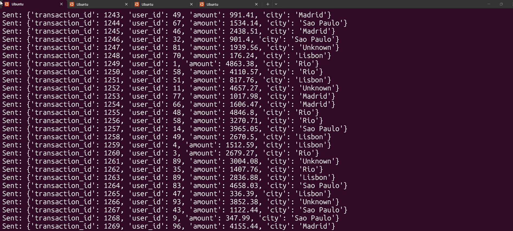
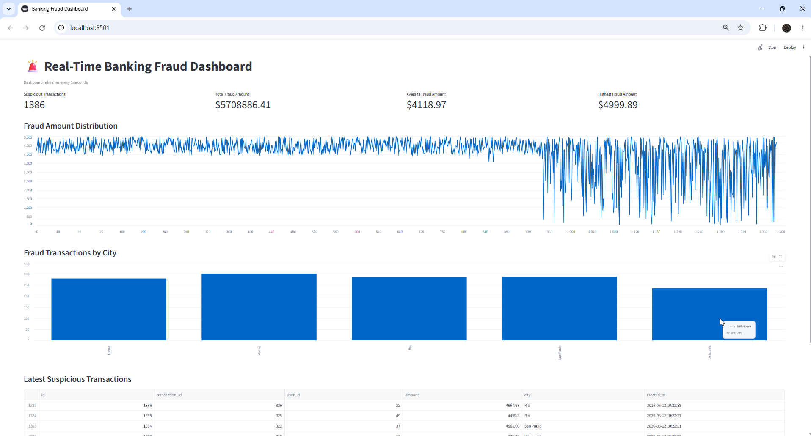
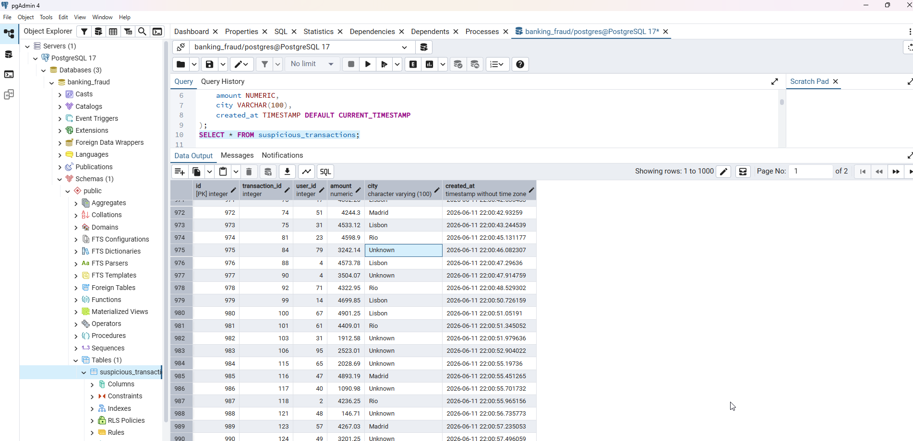
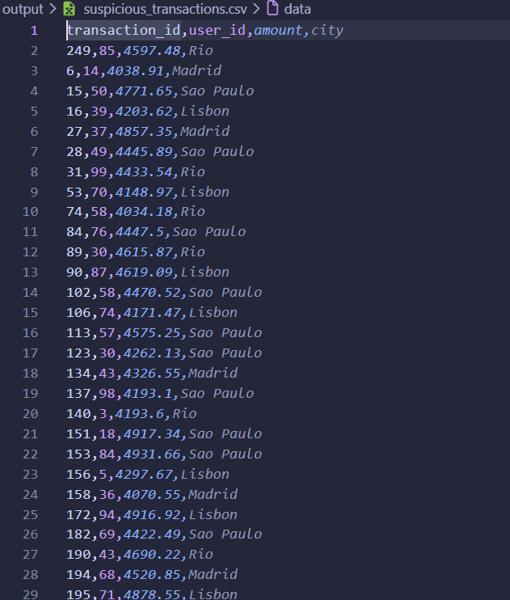
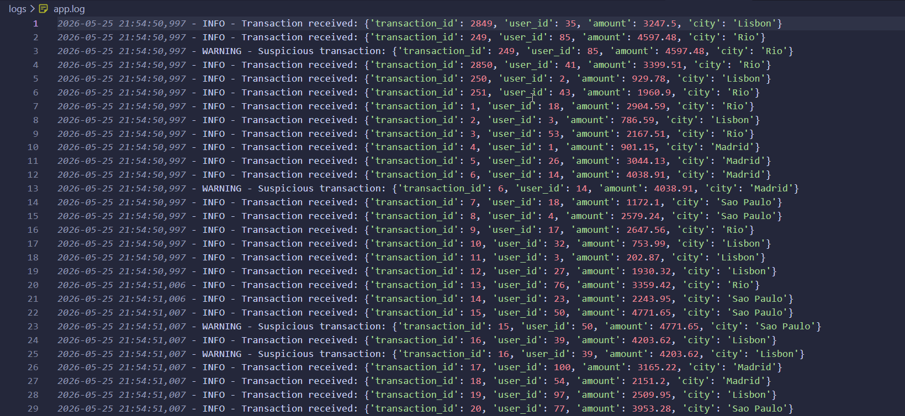
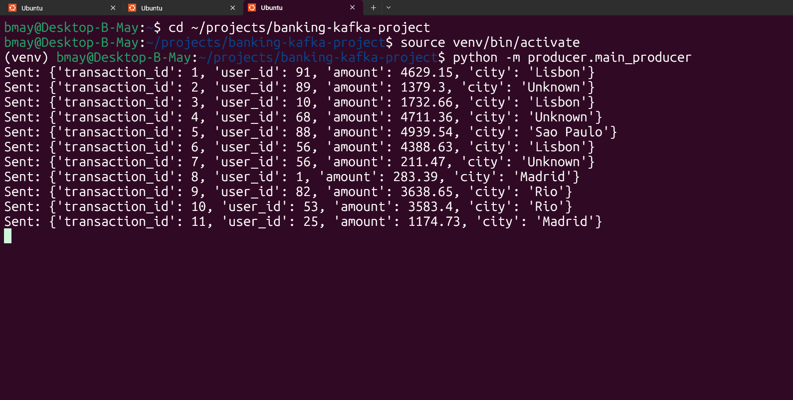
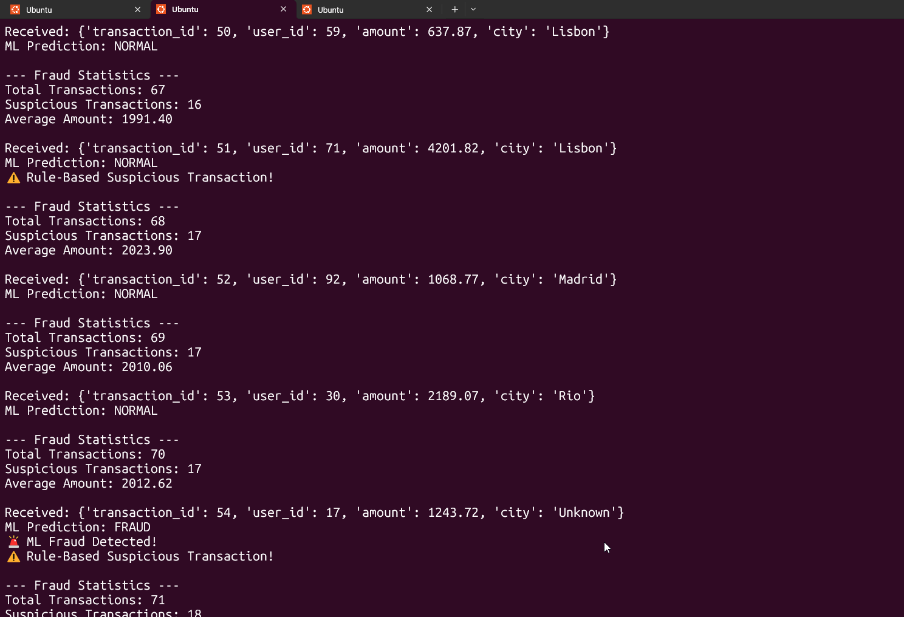
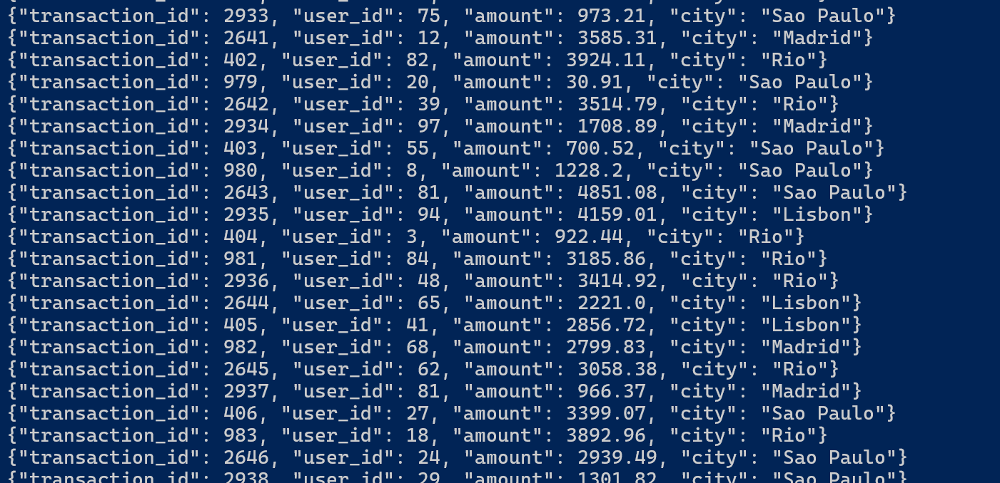

# Real-Time Banking Fraud Detection Pipeline

# Pipeline de Detección de Fraude Bancario en Tiempo Real

---

## System Architecture



---

## Live Demo



---


---

# 🇺🇸 English Version

## Overview

This project simulates a real-time banking fraud detection system using Apache Kafka, Python, PostgreSQL, and Streamlit.

The pipeline continuously generates banking transactions, streams them through Kafka, processes them in real time, detects suspicious activities, stores suspicious transactions in PostgreSQL and CSV files, logs events, and visualizes fraud analytics through a live dashboard.

The project demonstrates concepts commonly used in modern fintech, backend engineering, and data engineering systems.

---

## Engineering Highlights

* Event-driven streaming architecture
* Apache Kafka producer/consumer pipeline
* Modular Python project structure
* Real-time fraud detection workflow
* PostgreSQL persistence layer
* CSV persistence and reporting
* Centralized logging and monitoring
* Real-time analytics dashboard
* Streamlit live visualization

---

## Real-Time Streaming Architecture

```text
Python Producer
        ↓
Apache Kafka
        ↓
Consumer Analytics Engine
        ↓
Fraud Detection Logic
        ↓
PostgreSQL + CSV Storage
        ↓
FastAPI Analytics Layer
        ↓
Redis Cache
        ↓
REST API Endpoints
        ↓
Streamlit Dashboard
```

---

## Technologies Used

* Python
* Apache Kafka
* confluent-kafka
* PostgreSQL
* SQLAlchemy
* Streamlit
* Pandas
* JSON
* CSV
* Logging
* FastAPI
* Redis
* Pytest
* Coverage
* GitHub Actions
* Pydantic

---

## Project Structure

```text
banking-kafka-project/
│
├── producer/
│   └── main_producer.py
│
├── consumer/
│   ├── main_consumer.py
│   ├── database.py
│   ├── fraud_detection.py
│   ├── statistics.py
│   └── storage.py
│
├── dashboard/
│   └── dashboard.py
│
├── api/
│   ├── main.py
│   │
│   ├── routes/
│   │   └── fraud_routes.py
│   │
│   ├── services/
│   │   ├── fraud_service.py
│   │   └── analytics_service.py
│   │
│   ├── schemas/
│   │   └── fraud_schema.py
│   │
│   ├── models/
│   │   └── fraud_model.py
│   │
│   ├── database/
│   │   ├── connection.py
│   │   └── dependencies.py
│   │
│   ├── core/
│   │   ├── cache.py
│   │   ├── logging.py
│   │   ├── middleware.py
│   │   └── exception_handlers.py
│   │
│   └── exceptions.py
│
├── tests/
│   ├── routes/
│   ├── services/
│   ├── core/
│   └── conftest.py
│
├── config/
│   └── settings.py
│
├── logs/
│   └── app.log
│
├── output/
│   └── suspicious_transactions.csv
│
├── assets/
│
├── .github/
│   └── workflows/
│       └── ci.yml
│
├── requirements.txt
├── README.md
├── .env
└── .gitignore

---
## REST API Layer

The project includes a production-style FastAPI service exposing fraud analytics endpoints.

Features:

- Pagination
- Filtering
- Structured logging
- Redis caching
- Exception handling
- Automated testing
- OpenAPI / Swagger documentation

Available endpoints:

```text
GET /api/frauds
GET /api/latest-frauds
GET /api/frauds/highest
GET /api/statistics
GET /api/frauds/by-city
GET /api/frauds/daily-summary
```

---
## Testing

The project includes automated unit tests for:

- Fraud services
- Analytics services
- Redis cache layer
- Exception handlers
- API routes

Current coverage:

```text
100%
```

Tests are executed automatically through GitHub Actions.

---
## Continuous Integration

The project uses GitHub Actions for automated CI/CD validation.

On every push:

- Dependencies are installed
- Unit tests are executed
- Coverage is validated

This helps maintain code quality and reliability.

---
## Fraud Detection Logic

Transactions are flagged as suspicious when:

* transaction amount exceeds a configured threshold
* transaction originates from risky locations

Example:

```python
if amount > 4000:
    return True
```

---

## Dashboard Preview



The dashboard displays:

* suspicious transactions
* fraud metrics
* fraud amount analytics
* real-time updates

---

## PostgreSQL Persistence Layer



Suspicious transactions are persisted in PostgreSQL for:

* real-time analytics
* dashboard monitoring
* fraud investigation workflows
* future reporting pipelines

---

## CSV Output Storage



Suspicious transactions are automatically exported to CSV files for additional analysis and reporting.

---

## Logging and Monitoring



The logging system records:

* transaction processing
* suspicious activity alerts
* consumer errors
* monitoring events

---

## Producer Streaming Transactions



---

## Consumer Fraud Detection



---

## Kafka Topic Messages



---

## How to Run the Project

### 1. Start Apache Kafka

Start:

* Kafka Controller
* Kafka Broker

---

### 2. Create Kafka Topic

```bash
kafka-topics.bat --create ^
--topic banking-transactions ^
--bootstrap-server localhost:9092 ^
--partitions 1 ^
--replication-factor 1
```

---

### 3. Run Producer

```bash
python -m producer.main_producer
```

The producer continuously generates fake banking transactions and streams them into Kafka.

---

### 4. Run Consumer

```bash
python -m consumer.main_consumer
```

The consumer:

* processes streaming transactions
* detects suspicious activity
* stores suspicious transactions
* updates fraud statistics
* logs monitoring events

---

### 5. Run Dashboard

```bash
streamlit run dashboard/dashboard.py
```

The dashboard visualizes fraud analytics in real time.

---
## Run Tests

Run all tests:

```bash
pytest
```

Run coverage:

```bash
coverage run -m pytest
coverage report -m
```
---

## Logging

Application logs are stored in:

```text
logs/app.log
```

---

## CSV Output

Suspicious transactions are stored in:

```text
output/suspicious_transactions.csv
```

---

## Future Improvements

- PySpark Structured Streaming
- Machine Learning fraud scoring
- AWS deployment
- Azure deployment
- Docker deployment
- Real-time alert notifications

---

## Learning Objectives

This project was created to practice:

* event-driven architecture
* Kafka streaming systems
* real-time analytics pipelines
* backend engineering concepts
* fraud monitoring systems
* modular Python architecture
* data engineering fundamentals

---

# 🇪🇸 Versión en Español

## Descripción General

Este proyecto simula un sistema de detección de fraude bancario en tiempo real utilizando Apache Kafka, Python, PostgreSQL y Streamlit.

El pipeline genera continuamente transacciones bancarias, las transmite mediante Kafka, las procesa en tiempo real, detecta actividades sospechosas, almacena transacciones fraudulentas en PostgreSQL y archivos CSV, registra eventos y visualiza analíticas de fraude mediante un dashboard en vivo.

El proyecto demuestra conceptos utilizados en sistemas modernos de fintech, backend engineering y data engineering.

---

## Características Principales

* Arquitectura orientada a eventos
* Pipeline Producer/Consumer con Kafka
* Arquitectura modular en Python
* Procesamiento en tiempo real
* Detección de fraude
* Persistencia en PostgreSQL
* Exportación CSV
* Sistema de logs y monitoreo
* Dashboard en tiempo real


---

## Tecnologías Utilizadas

* Python
* Apache Kafka
* PostgreSQL
* SQLAlchemy
* Streamlit
* Pandas
* JSON
* CSV
* Logging
* FastAPI
* Redis
* Pytest
* Coverage
* GitHub Actions
* Pydantic

---

## Vista del Dashboard


---

## Futuras Mejoras

* API REST con FastAPI
* Docker
* Despliegue en la nube
* PySpark Structured Streaming
* Machine Learning para fraude

---

## Objetivos de Aprendizaje

* arquitectura orientada a eventos
* streaming con Kafka
* analítica en tiempo real
* backend engineering
* data engineering
* sistemas de detección de fraude
