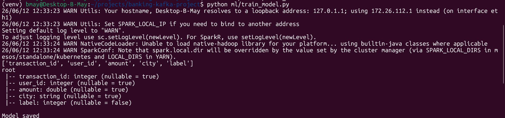
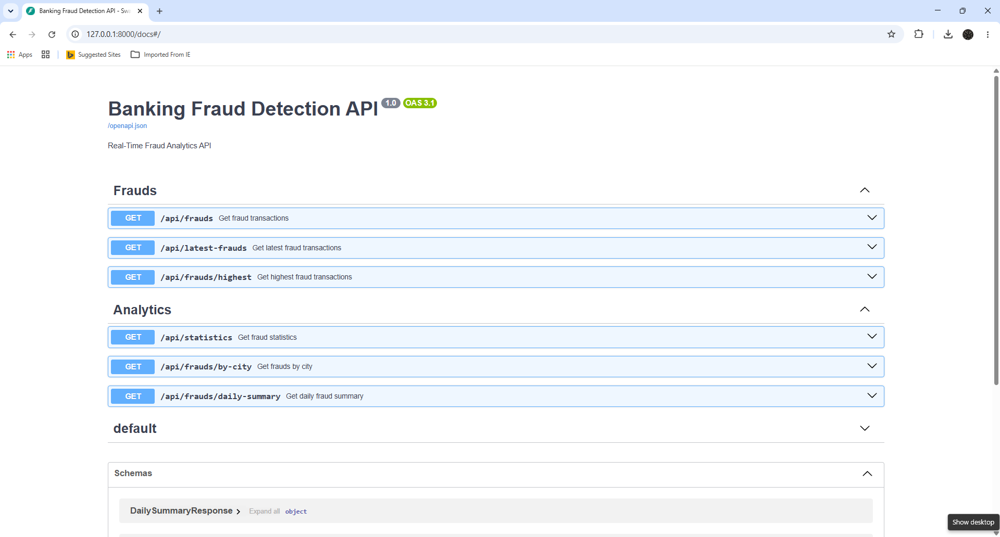
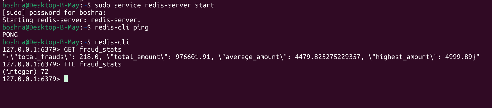
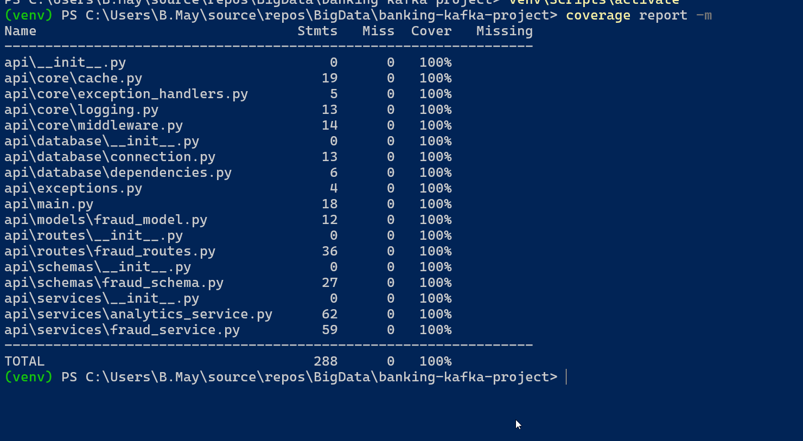
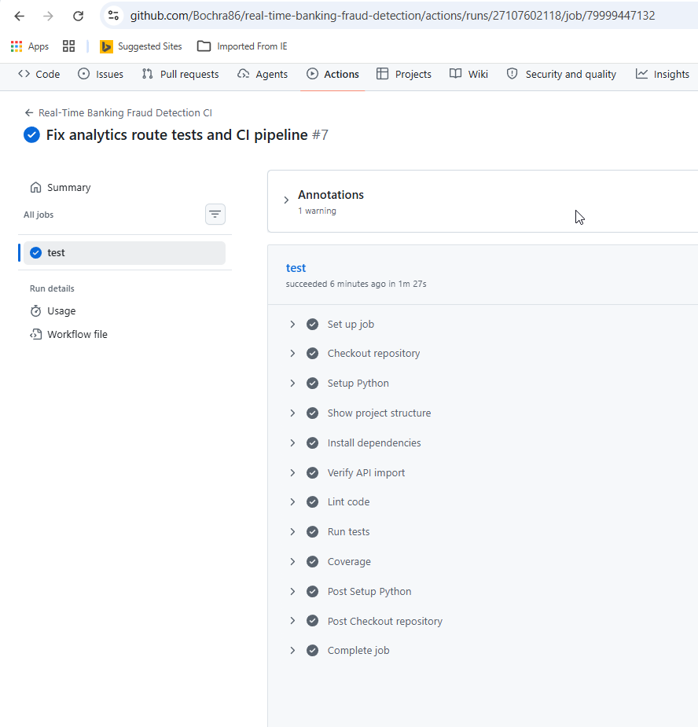

# Real-Time Banking Fraud Detection Pipeline

# Pipeline de Detección de Fraude Bancario en Tiempo Real

---

## System Architecture


---

## Live Demo


---


---

# 🇺🇸 English Version

## Overview

This project is a production-style real-time banking fraud detection system designed using a modern event-driven and machine learning–powered architecture.

It simulates high-frequency banking transactions and processes them through a scalable data pipeline that combines stream processing, ML inference, rule-based detection, and real-time analytics.

The system is built with Python, Apache Kafka, Apache Spark Streaming, Machine Learning models, PostgreSQL, Redis, FastAPI, and Streamlit.

The goal of the project is to demonstrate how real-world fintech platforms detect fraud in real time using a combination of streaming infrastructure, predictive models, and analytics systems.

---

## Engineering Highlights

- Real-time transaction generation and streaming
- Scalable event-driven architecture using Kafka
- Stream processing using Spark Streaming
- Machine Learning-based fraud detection (model inference layer)
- Hybrid detection system (ML + rule-based engine)
- Persistent storage in PostgreSQL + CSV backups
- Centralized logging and monitoring
- High-performance API layer using FastAPI
- Redis caching for low-latency analytics
- Interactive Streamlit dashboard for live monitoring

---

## Real-Time Streaming Architecture

```text
Python Producer
        ↓
Apache Kafka (Event Streaming)
        ↓
Apache Spark Streaming (Real-time Processing)
        ↓
ML Fraud Detection Engine (Model Inference)
        ↓
Analytics + Consumer Engine
        ↓
Fraud Detection Rules Engine
        ↓
PostgreSQL + CSV Storage Layer
        ↓
FastAPI (Analytics & Data API)
        ↓
Redis Cache Layer
        ↓
REST API Endpoints
        ↓
Streamlit Dashboard (Visualization Layer)
```

---

## 🧰 Technologies Used

- Python
- Apache Kafka
- confluent-kafka
- PostgreSQL
- SQLAlchemy
- Streamlit
- Pandas
- JSON
- CSV
- Logging
- FastAPI
- Redis
- Pytest
- Coverage
- GitHub Actions
- Pydantic

---

## Project Structure

```text
banking-kafka-project/
│
├── producer/
│   └── main_producer.py
│
├── consumer/
│   ├── main_consumer.py
│   ├── database.py
│   ├── fraud_detection.py
│   ├── statistics.py
│   └── storage.py
│
├── ml/
│   ├── models/
│   ├── train_model.py
│   └── predict.py
│
├── dashboard/
│   └── dashboard.py
│
├── api/
│   ├── main.py
│   ├── routes/
│   │   └── fraud_routes.py
│   ├── services/
│   │   ├── fraud_service.py
│   │   └── analytics_service.py
│   ├── schemas/
│   │   └── fraud_schema.py
│   ├── models/
│   │   └── fraud_model.py
│   ├── database/
│   │   ├── connection.py
│   │   └── dependencies.py
│   ├── core/
│   │   ├── cache.py
│   │   ├── logging.py
│   │   ├── middleware.py
│   │   └── exception_handlers.py
│   └── exceptions.py
│
├── spark/
│   └── spark_consumer.py
│
├── tests/
│   ├── routes/
│   ├── services/
│   ├── core/
│   └── conftest.py
│
├── config/
│   └── settings.py
│
├── logs/
│   └── app.log
│
├── output/
│   └── suspicious_transactions.csv
│
├── assets/
├── requirements.txt
├── README.md
└── .gitignore

```
---

## 🤖 ML Layer (Fraud Detection Model)




This project includes a Machine Learning layer built using Apache Spark MLlib to detect fraudulent transactions.

A Random Forest model is trained on historical banking transaction data loaded from CSV files.

Feature engineering is applied using Spark transformations, including encoding categorical variables like city and assembling numerical features.

A synthetic label is generated based on business rules (high amount, risky user IDs, unknown cities).

The full pipeline includes StringIndexer, VectorAssembler, and RandomForestClassifier.

All steps are combined into a Spark ML Pipeline for reproducibility and scalability.

After training, the model is saved locally for later use in real-time fraud detection.

📁 Saved Model Path:
ml/models/fraud_model

---

### Feature Engineering & Label Creation

A synthetic fraud label is created using business rules:

```python
df = df.withColumn(
    "label",
    when(
        ((col("amount") > 3500) & (col("user_id") < 10))
        | (col("city") == "Unknown"),
        1
    ).otherwise(0)
)


```
---
## REST API Layer



The project includes a production-style FastAPI service exposing fraud analytics endpoints.

Features:

- Pagination
- Filtering
- Structured logging
- Redis caching
- Exception handling
- Automated testing
- OpenAPI / Swagger documentation

Available endpoints:

```text
GET /api/frauds
GET /api/latest-frauds
GET /api/frauds/highest
GET /api/statistics
GET /api/frauds/by-city
GET /api/frauds/daily-summary
```
---

## Redis Cache



The API uses Redis to cache analytics results and reduce database queries.

Cached data includes:

- Fraud statistics
- Frauds by city
- Daily summaries
- Latest frauds
- Highest frauds

Benefits:

- Faster responses
- Reduced PostgreSQL load
- Automatic cache expiration (TTL)

### Example

```text
cache_miss → PostgreSQL → Redis
cache_hit  → Redis
```

---
## Testing



The project includes automated unit tests for:

- Fraud services
- Analytics services
- Redis cache layer
- Exception handlers
- API routes

Current test coverage:

```text
100%
```

Tests are executed automatically through GitHub Actions.

---
## Continuous Integration



The project uses GitHub Actions for automated CI/CD validation.

GitHub Actions automatically runs:

- Flake8 linting
- Pytest unit tests
- Coverage checks

On every push:

- Dependencies are installed
- Unit tests are executed
- Coverage is validated

This helps maintain code quality and reliability.

---


## Dashboard Preview


The dashboard displays:

* suspicious transactions
* fraud metrics
* fraud amount analytics
* real-time updates

---

## PostgreSQL Persistence Layer


Suspicious transactions are persisted in PostgreSQL for:

* real-time analytics
* dashboard monitoring
* fraud investigation workflows
* future reporting pipelines

---

## CSV Output Storage


Suspicious transactions are automatically exported to CSV files for additional analysis and reporting.

---

## Logging and Monitoring


The logging system records:

* transaction processing
* suspicious activity alerts
* consumer errors
* monitoring events

---

## Producer Streaming Transactions


---

## Consumer Fraud Detection


---

## Kafka Topic Messages


---

## How to Run the Project

### 1. Start Apache Kafka

Start:

* Kafka Controller
* Kafka Broker

---

### 2. Create Kafka Topic

```bash
kafka-topics.bat --create ^
--topic bank-transactions ^
--bootstrap-server localhost:9092 ^
--partitions 1 ^
--replication-factor 1
```

---

### 3. Run Producer

```bash
python -m producer.main_producer
```

The producer continuously generates fake banking transactions and streams them into Kafka.

---

### 4. Run Consumer

```bash
python -m consumer.main_consumer
```

The consumer:

* processes streaming transactions
* detects suspicious activity
* stores suspicious transactions
* updates fraud statistics
* logs monitoring events

---

### 5. Run Dashboard

```bash
streamlit run dashboard/dashboard.py
```

The dashboard visualizes fraud analytics in real time.

---
## Run Tests

Run all tests:

```bash
pytest
```

Run coverage:

```bash
coverage run -m pytest
coverage report -m
```
---

## Logging

Application logs are stored in:

```text
logs/app.log
```

---

## CSV Output

Suspicious transactions are stored in:

```text
output/suspicious_transactions.csv
```

---


## Learning Objectives

This project was created to practice:

* event-driven architecture
* Kafka streaming systems
* real-time analytics pipelines
* backend engineering concepts
* fraud monitoring systems
* modular Python architecture
* data engineering fundamentals

---

# 🇪🇸 Versión en Español

## Descripción General

Este proyecto es un sistema de detección de fraude bancario en tiempo real con un enfoque de producción, diseñado utilizando una arquitectura moderna basada en eventos y potenciada por machine learning.

Simula transacciones bancarias de alta frecuencia y las procesa a través de una canalización de datos escalable que combina procesamiento en streaming, inferencia de modelos de ML, detección basada en reglas y análisis en tiempo real.

El sistema está construido con Python, Apache Kafka, Apache Spark Streaming, modelos de Machine Learning, PostgreSQL, Redis, FastAPI y Streamlit.

El objetivo del proyecto es demostrar cómo las plataformas fintech del mundo real detectan fraudes en tiempo real utilizando una combinación de infraestructura de streaming, modelos predictivos y sistemas de análisis de datos.

---

## Características Principales

*  Generación y transmisión de transacciones en tiempo real  
*  Arquitectura escalable basada en eventos utilizando Kafka  
*  Procesamiento de flujos de datos con Spark Streaming  
*  Detección de fraude basada en Machine Learning (capa de inferencia de modelos)  
*  Sistema híbrido de detección (ML + motor basado en reglas)  
*  Almacenamiento persistente en PostgreSQL + copias de seguridad en CSV  
*  Registro centralizado de logs y monitoreo  
*  Capa de API de alto rendimiento con FastAPI  
*  Caché con Redis para análisis de baja latencia  
*  Panel interactivo con Streamlit para monitoreo en tiempo real  

---

## Tecnologías Utilizadas

* Python
* Apache Kafka
* PostgreSQL
* SQLAlchemy
* FastAPI
* Redis
* Streamlit
* Pandas
* Pytest
* Coverage
* GitHub Actions
* Pydantic
* Pytest
* Coverage
* GitHub Actions
* Pydantic

---

## 🤖 Capa de Machine Learning (Modelo de Detección de Fraude)

Este proyecto incluye una capa de Machine Learning construida con Apache Spark MLlib para detectar transacciones fraudulentas.

Se entrena un modelo Random Forest utilizando datos históricos de transacciones bancarias cargados desde archivos CSV.

Se aplica ingeniería de características utilizando transformaciones de Spark, incluyendo la codificación de variables categóricas como la ciudad y la combinación de variables numéricas en un solo vector de características.

Se genera una etiqueta sintética basada en reglas de negocio (montos elevados, identificadores de usuarios de riesgo, ciudades desconocidas).

El pipeline completo incluye StringIndexer, VectorAssembler y RandomForestClassifier.

Todos los pasos se combinan en un Spark ML Pipeline para garantizar reproducibilidad y escalabilidad.

Después del entrenamiento, el modelo se guarda localmente para su uso posterior en la detección de fraude en tiempo real.

📁 Ruta del modelo guardado:
ml/models/fraud_model

---

### Ingeniería de Características y Creación de Etiquetas

Se crea una etiqueta sintética de fraude utilizando reglas de negocio:

```python
df = df.withColumn(
    "label",
    when(
        ((col("amount") > 3500) & (col("user_id") < 10))
        | (col("city") == "Unknown"),
        1
    ).otherwise(0)
)

```
---

## API REST

La aplicación incluye una API desarrollada con FastAPI para consultar información sobre fraude bancario.

Endpoints disponibles:

```text
GET /api/frauds
GET /api/latest-frauds
GET /api/frauds/highest
GET /api/statistics
GET /api/frauds/by-city
GET /api/frauds/daily-summary
```

Características:

* Paginación
* Filtros
* Logging estructurado
* Caché con Redis
* Manejo centralizado de excepciones
* Documentación Swagger/OpenAPI

---

## Caché con Redis

Redis se utiliza para almacenar resultados de consultas frecuentes y reducir la carga sobre PostgreSQL.

Datos almacenados en caché:

* Estadísticas de fraude
* Fraudes por ciudad
* Resúmenes diarios
* Últimos fraudes detectados
* Fraudes con mayor importe

Beneficios:

* Respuestas más rápidas
* Menor carga en la base de datos
* Escalabilidad mejorada
* Expiración automática de caché (TTL)

---

## Pruebas Automatizadas

El proyecto incluye pruebas unitarias para:

* Servicios de fraude
* Servicios analíticos
* Capa de Redis
* Manejadores de excepciones
* Endpoints de la API

Cobertura actual:

```text
100%
```

---

## Integración Continua

GitHub Actions ejecuta automáticamente:

* Instalación de dependencias
* Ejecución de pruebas
* Validación de cobertura

en cada push al repositorio.

---

## Objetivos de Aprendizaje

* Arquitecturas orientadas a eventos
* Sistemas de streaming con Kafka
* Analítica en tiempo real
* Backend Engineering
* Data Engineering
* Sistemas de detección de fraude
* APIs modernas con FastAPI
* Estrategias de caché con Redis
